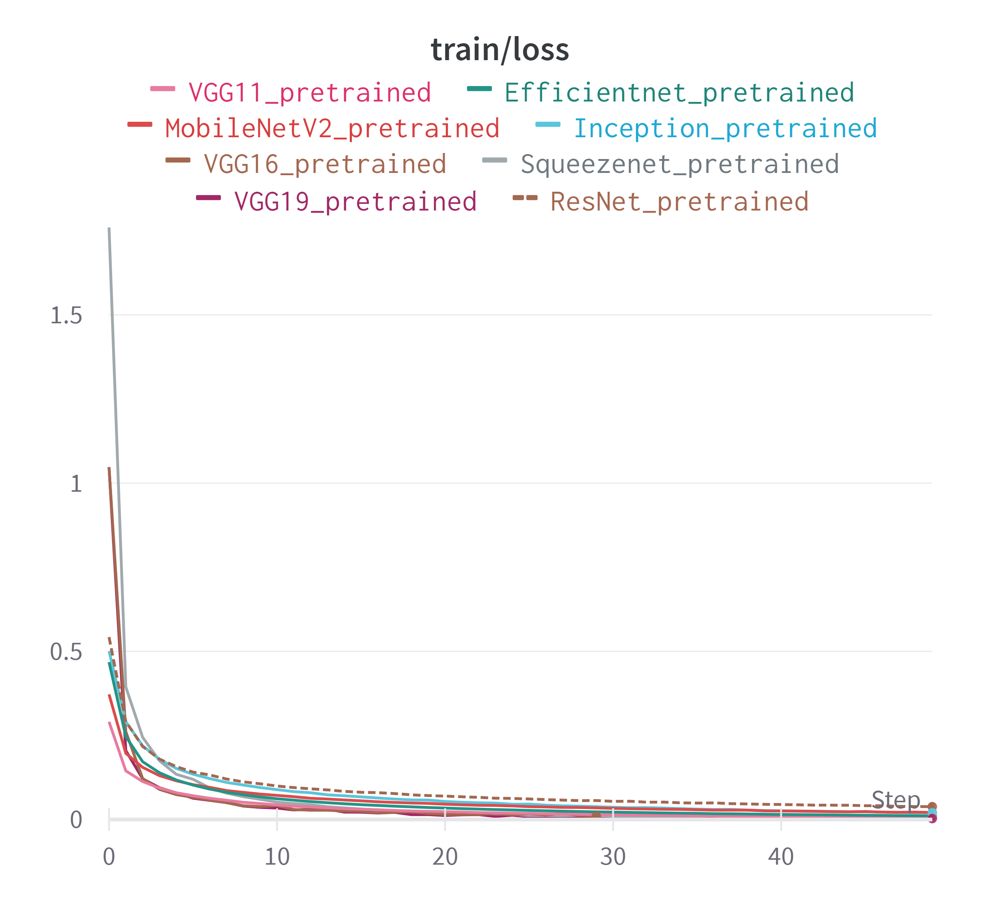

# Поиск свободных мест в рабочих пространствах

## Last update

:white_check_mark: исправлены баги, проведен рефакторинг кода (typing и др)

:white_check_mark: добавлено обучение нескольких моделей (vgg, efficientnet, inception и др)

:white_check_mark: добавлено логгирование в WandB

:white_check_mark: пересобран датасет (примеры кадров в `data/dataset/val/`)

:white_check_mark: проведены эксперименты

## Overview

**Исполнители:** Дмитрий Гайфуллин, Никита Никонов

**Цель:** разработать программную систему, которая сможет по входным данным (видеопоток или изображение) находить рабочие места в аудитории и определять свободны они или заняты.

**Примеры работ/датасетов/полезные материалы:**

* [ImageNet](https://image-net.org/challenges/LSVRC/2012/analysis/) (множество различных видов стульев, сидячих мест и тд.)
* [Статья на analyticsvidhya](https://www.analyticsvidhya.com/blog/2017/08/finding-chairs-deep-learning-part-i/)
* [Library seat detection API (GitHub repo)](https://github.com/RexxarCHL/library-seat-detection) (ниже видео - пример работы)

<a href="http://www.youtube.com/watch?feature=player_embedded&v=CuB9HgXosaA
" target="_blank"></a>

* [Датасет по оценке позы человека MPOSE2021](https://github.com/PIC4SeRCentre/MPOSE2021), где также присутствуют позы "сидит", "стоит" и другие.
* [Датасет с видео рабочих пространств](https://homepages.inf.ed.ac.uk/rbf/OFFICEDATA/), который уже имеет разметку по классам - человек сидит, комната пустая и др.
* [Подборка стримов](https://en.world-cam.ru/cams/restaurants/) из раличных мест: кафе, бары, улицы.

**Классы:**

* Свободное место
* Занятое место

**Предварительные способы решения:**

1. Обрезка с изображения сидячего места и проведение дальнейшей классификации (**выбран данный способ**).
2. Детектирование всех сидячих мест (например, с помощью предобученного на ImageNet'e детектора) и проверка внутри полученных bounding box'ов занятости места.
3. Если имеем дело со статической камерой (одной или несколькими), существует способ при котором сидячие места задаются вручную (то есть коородинаты bbox'ов) и затем по этим координатам происходит выделение области и проверка ее на занятость.
4. Также можно детектировать места и людей рядом с ними с оценкой позы (человек сидит, стоит) и с последующей классификацией доступности этого места (для оценки позы подходит датасет MPOSE2021).

**Идеи по реализации сервиса:**

* Web API с помощью Flask
* Talegram-bot

Также сервис будет завернут в *docker container*, чтобы все его зависимости были упакованы в единый образ и была возможность беспроблемно запустить приложение.

## Данные

Для обучения модели классификации занятости/доступности места в аудитории были выбраны два набора данных.

**Edinburgh dataset**

[Ссылка на датасет](https://homepages.inf.ed.ac.uk/rbf/OFFICEDATA/)

Набор данных представляет из себя видеостримы из Школы информатики Эдинбургского университета в течение 20 дней. Двенадцать дней из одного офиса, плюс 2 или 3 дополнительных дня в 3 других офисах. Данные получают с помощью стационарной камеры в виде набора цветных изображений с разрешением 1280\*720 пикселей, снятых со средней скоростью около 1 кадра в секунду. В основном на изображениях изображен один работающий человек или пустой офис. Тем не менее, иногда в офисе есть еще несколько человек для встречи.

Помимо видео в наборе данных также присутствуют изображения в формате *jpg*, которые как раз были размечены и использованы в дальнейшем для обучения модели.

<p style="text-align: center;">  </p>

Для разметки были выбраны 4 дня.

| Номер дня  | Количество фреймов |
| ------------- | ------------- |
| 1  |  10047 |
| 14  | 29004  |
| 17  |  10047 |
| 19  | 27993  |
| 20  | 31706  |

Так как изображения в основном представляют одни и те же сцены, то из каждого дня было выбрана репрезентативная выборка порядка 3000-5000 изображений.

Для получения датасета был использован скрипт, представленный в папке `docs/edinburgh/prepare_edinburgh.py`. Соответственно, для его выполнения достаточно выполнить команду `python prepare_edinburgh.py`.

Для нарезки свободных и занятых мест была использована модель yolov5. Для получения данной модели необходимо клонировать библиотеку с yolo к себе на машину.

`git clone https://github.com/ultralytics/yolov5.git`

Скрипт нарезает необходимые сцены и сохраняет в зависимости от класса:
* 0 - свободное место
* 1 - место занято (присутствует человек)

Пример изображений из каждого класса:

<p align="middle">
  
   
</p>

**Office dataset**

Также был использован следующий датасет ([ссылка](https://disk.yandex.ru/d/cxjWHwixSkKmEw)), который представляет собой 24 записи с камеры из двух офисов (left и right) в течение нескольких дней. 

Для получения изображений с данных видеостримов был использован скрипт `data/office/prepare_office.py`, который нарезает изображения каждые 30 секунд в каждом видео. Также данный скрипт обрезает необходимые сцены, которые заданы вручную (так как рабочие места в офисе стационарны и не изменяются) в файлах `data/office/left.txt` и `data/office/right.txt`.

<p style="text-align: center;">  </p>

Для получения датасета необходимо скачать датасет с видео и сохранить в папку `office`, после чего достаточно выполнить команду `python prepare_office.py`.

Пример изображений из каждого класса:

<p align="middle">
  
   
</p>

Стоит отметить, что изображения данного набора имеют более низкое качество, чем набора Edinburgh.

**Additional data**

Датасет был расширен засчет кадров с различных live стримов с камер, установленных в кафе, офисах, рабочих пространствах.

В последствии данные кадры были преобразованы с помощью аугментаций и также добавлены в исходный датасет. Пример аугментаций лежит в файле `classification_model/augmentations.py`.

Стоит отметить, что данные кадры наиболее приближены к реальным условиям, которые могут использоваться заказчиком.

## Обучение

### Python

Python 3.8.10

### Dataset

Для загрузки и обработки данных был написан класс `CustomDataset`, который находится в модуле `classification_model/dataset.py`.

### Trainer

Для обучения был реализован класс Trainer, который позволяет производить все необходимые действия с моделью. При создании объекта Trainer, в качестве параметров он получает конфиг-файл, модель, оптимизатор и лосс (два последних могут иметь значения None).

Trainer содержит следующие методы:

* fit_epoch - обучение одной эпохи
* train - цикл обучения
* validate - валидация
* predict - предсказание на тестовом даталоадере, возвращает истинные метки (y_true) и вероятности (y_pred)
* inference - предсказание класса для одной картинки
* get_confusion_matrix - получение матрицы ошибок на тестовом даталоадере

### Invoke

Для запуска всех необходимых экспериментов был использован фреймворк **Invoke** ([документация](https://www.pyinvoke.org/)).

Invoke — это библиотека для управления подпроцессами, ориентированными на оболочку, и организации исполняемого кода Python в задачи, вызываемые через CLI. Созддание Invoke было вдохновлено следующими фреймворками (make/rake, Fabric 1.x и т.д.).

Invoke предоставляет чистый высокоуровневый API для запуска команд оболочки и определения/организации функций задач из файла `tasks.py`.

Посмотреть доступные задачи можно с помощью команды `inv -l`.

Запуск команд:

```
inv train
inv get-scores
inv inference path_to_image
inv get-confusion-matrix
```

Для запуска также потребуется конфиг-файл `invoke.yml`, где указаны вся необходимая информация для обучения: batch size, image size, num_epochs и др.

### Logging

Для проведения экспериментов и сохранения необходимых результатов обучения моделей была добавлена система трекинга экспериментов - WandB (Weights&Biases). 

Логи проводимых экспериментов можно посмотреть по следующей ссылке: https://wandb.ai/cv-itmo/seat_classification?workspace=user-dmitryai

Также для локального сохранения результатов используется логирование файлов в папку `experiments`, которая должны быть создана при запуске обучения. Во время обучения в ней создаются подпапки:

* pics (сохранение изображений)
* weights (сохранение весов моделей и модели в формате торчскрипт)

### Experiments

В ходе экспериментов были использованы следующие модели, как предобученные (на imagenet), так и нет:

* ResNet
* EfficientNet
* VGG11
* VGG16
* VGG19
* InceptionV3
* SqueezeNet
* MobileNetv2

В конце обучения происходило сохранение наилучшей модели, последней модели, а также наилучшей модели в формате torchscript.

### Metrics

В качетсве функции ошибки использовалась перекрестная кросс-энтропия (torch.nn.CrossEntropyLoss).

В качестве оптимизатора использовался Adam.

Также по тестовой выборке считались следующие метрики оценки качества классификации:

* Accuracy
* F1-score
* Recall

Помимо этого также рассчитывалась матрица ошибок (confusion matrix).

Графики лосса и скоринга моделей при обучении:

<p align="middle">
  
   
</p>

<p align="middle">
  
   
</p>

### Results

**Непредобученные модели**

Итоговые метрики F1-score, которые показали непредобученные модели на тестовой выборке, приведены в следующей таблице.

<p style="text-align: center;">  </p>

**Предобученные модели**

Итоговые метрики F1-score, которые показали предобученные модели на тестовой выборке, приведены в следующей таблице.

<p style="text-align: center;">  </p>

**Вывод**

По результатам проведенных экспериментов наилучшим образом себя показала модель VGG11: как в предобученном, так и в непредобученном случае.

Графики лосса и скора на трейне и валидации отображены ниже.

<p align="middle">
  
   
</p>

<p align="middle">
  
   
</p>

В таблице также приведены метрики по каждой модели. Как видно по графикам и таблице, предобученная модель дает качество классификации лучше, чем непродобученная.

| **Model**  | **F1-score** | **Accuracy** | **Recall** |
| ------------- | ------------- | ------------- | ------------- |
| VGG11 not pretrained  |  0.993 |  0.9932 |  0.993 |
| VGG11 pretrained  | 0.9693  |  0.9706 |  0.958 |

Итог: в ходе экспериментов лучшего качества классификации достигла модель VGG11 предобученная на imagenet.

Сбор Docker контейнера : docker build . -t big_brat_server_2

Запуск контейнера: docker run --rm -it -p 8888:8888 big_brat_server_2

Страница с моделью открывается на http://localhost:8888
